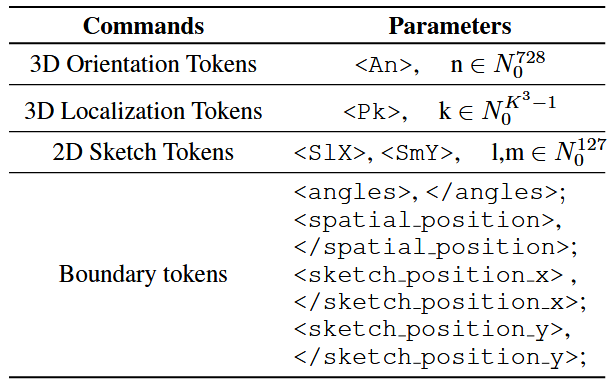

## 输入
### 参考图片的理解

参考MLLM2CAD，使用了一个 Perceiver 重采样器。它的作用像一个“信息压缩机”。无论输入多少张图片（$k$ 是可变的），它都通过一组固定数量的可学习 Query（查询向量），从图片特征中“抓取”最有用的信息。

## 模型架构

本项目的核心是一个先进的、为CAD生成任务量身定制的生成模型。它并未使用传统的Transformer编码器，而是巧妙地利用一个外部的、预训练的多模态大语言模型（MLLM，如LLaVA）作为其“编码器”，并在此基础上搭建了一个解耦的**双解码器（Dual Decoder）**结构。

### 1. “编码器”：外部 MLLM

模型不包含一个需要从头训练的编码器。相反，它直接接收来自强大MLLM的输出特征 `llm_features`。这个外部LLM负责理解输入的自然语言、草图等多模态指令，并将其转换为蕴含丰富设计意图的语义向量。

### 2. 适配与意图聚合

在进入解码阶段前，来自MLLM的高维特征会经过两个步骤的处理，以形成一个全局的“意图向量” `z`：

- **适配层 (`Adapter`)**：通过一个线性层，将MLLM的高维特征（如4096维）压缩到当前模型所需的工作维度（如256维）。
- **聚合 (`Pooling`)**：通过对序列特征取平均值，将序列化的特征聚合成一个单一的、代表用户整体设计意图的全局特征向量 `z`。

### 3. 双解码器 (Dual Decoder)

全局意图向量 `z` 被送入两个协同工作的专业解码器，将一个复杂的生成任务拆分为两个更简单的子任务：

1.  **命令解码器 (`CommandDecoder`)**
    - **职责**：预测高级操作命令序列（做什么），例如 `EXTRUDE`, `CUT`, `SKETCH`。
    - **工作方式**：它接收 `z` 作为上下文，并行地（非自回归地）生成所有步骤的命令。
    - **关键输出**：除了预测的命令，它还生成一个 `guidance`（指导）向量，该向量包含了模型对“当前是什么命令”的内部理解。

2.  **参数解码器 (`ArgsDecoder`)**
    - **职责**：预测每个命令的具体参数（怎么做），例如坐标、距离、半径等。
    - **工作方式**：它的预测同时基于全局意图 `z` 和来自命令解码器的 `guidance` 向量。这种设计使得参数的预测可以充分利用“当前正在执行什么命令”这一上下文信息，从而提高准确性。

### 数据流图

```
  自然语言/草图
        │
        ▼
[ 外部 MLLM (作为编码器) ]
        │
        ▼
  llm_features (高维语义特征)
        │
        ▼
[ Adapter层 (维度适配) ]
        │
        ▼
  z (全局意图向量)
        │
        ├───────────┐
        ▼           ▼
[ CommandDecoder ]  [ ArgsDecoder ]
        │           ▲
        │           │ (接收 z 和 guidance)
        └───────────┤
                    │
   (生成 guidance)  │
        │           │
        ▼           ▼
  命令序列 (logits)  参数序列 (logits)
```

### 空间定位token机制
- 三维草图平面方向 Token
- 三维坐标定位 Token
- 二维草图坐标 Token


根据你的要求，我整理了 **CAD-GPT** 论文中关于“空间定位 Token 机制（3D Modeling Spatial Localization Mechanism）”的完整技术说明。

这份文档详细解析了该机制的动机、具体编码算法、Token 结构以及嵌入增强方法，你可以直接将其作为你科研笔记或技术报告的一部分。

---

# CAD-GPT 空间定位 Token 机制详解

## 1. 设计动机 (Motivation)
在基于大语言模型（LLM）的 CAD 生成任务中，直接回归预测连续的浮点数（如坐标 `(0.12, -0.5, 3.14)`）存在显著困难。LLM 本质上是基于离散 Token 进行概率预测的，缺乏对连续 3D 空间和几何变换的固有感知能力。

为了解决这一问题，CAD-GPT 提出了一种 **“3D 建模空间定位机制” (3D Modeling Spatial Localization Mechanism)**。其核心思想是将连续的几何参数（位置、角度、2D坐标）离散化为特定设计的 **“空间 Token”**，并将这些 Token 加入 LLM 的词表，使模型能够像生成文本一样“生成”空间位置。

## 2. 核心组件与编码逻辑

该机制将空间信息分为三类，分别设计了不同的 Token 化策略：

### 2.1 3D 草图平面方向 Token (3D Sketch Plane Orientation Tokens)
用于描述草图平面（Sketch Plane）在 3D 空间中的朝向。

* **原始参数：** 欧拉角 $(\theta, \phi, \gamma)$，用于构建旋转矩阵，将世界坐标系对齐到草图平面的局部坐标系。
* **离散化策略：**
    * 将每个角度（$\theta, \phi, \gamma$）的取值范围离散化为 **9 个整数等级**。
    * 按照 $\theta \rightarrow \phi \rightarrow \gamma$ 的顺序（从低位到高位）进行组合编码。
* **Token 格式：** `<An>`，其中 $n \in \{0, 1, ..., 728\}$。
* **词表大小：** $9 \times 9 \times 9 = 729$ 个唯一 Token。
* **物理意义：** 每个 Token 代表 3D 空间中一个特定的旋转姿态组合。

### 2.2 3D 坐标定位 Token (3D Coordinate Location Tokens)
用于描述草图平面在 3D 空间中的原点位置 $(p_x, p_y, p_z)$。

* **原始参数：** 3D 坐标点 $(x, y, z)$。
* **预处理：** 首先将整个 CAD 模型归一化到 $1 \times 1 \times 1$ 的单位立方体中。
* **离散化策略（体素化）：**
    * 将单位立方体划分为 $K \times K \times K$ 的网格，其中 **$K=36$**。
    * 坐标点的离散化索引按照 $z \rightarrow y \rightarrow x$ 的顺序（类似 MeshGPT 的做法）压平为一维索引。
* **Token 格式：** `<Pk>`，其中 $k \in \{0, 1, ..., K^3-1\}$（即 $0 \sim 46655$）。
* **词表大小：** $36^3 = 46656$ 个唯一 Token。
* **物理意义：** 模型不再预测具体的浮点坐标，而是分类预测该点落在哪一个微小的 3D 体素（Voxel）网格中。

### 2.3 2D 草图坐标 Token (2D Sketch Coordinate Tokens)
用于描述在 2D 草图平面上绘制曲线（如 Line, Arc）的具体控制点。

* **原始参数：** 2D 坐标 $(x, y)$。
* **预处理：** 将每个 2D 草图轮廓在其边界框（Bounding Box）内进行归一化。
* **离散化策略：**
    * 将数值量化为 **128 个等级**。
    * X 轴和 Y 轴使用独立的 Token 系列。
* **Token 格式：**
    * X 轴坐标：`<SlX>`，其中 $l \in \{0, ..., 127\}$。
    * Y 轴坐标：`<SmY>`，其中 $m \in \{0, ..., 127\}$。
* **词表大小：** $128 + 128 = 256$ 个 Token。

## 3. 结构化增强设计

为了让 LLM 更好地理解这些新 Token，CAD-GPT 还引入了边界标记和可学习嵌入。

### 3.1 边界 Token (Boundary Tokens)
为了区分普通文本和空间参数，每类空间 Token 都被包裹在特殊的边界符中。这起到了“提示符”的作用，告诉模型接下来要生成空间数据了。

* **角度边界：** `<angles>` ... `</angles>`
* **3D 位置边界：** `<spatial_position>` ... `</spatial_position>`
* **2D 草图边界：** `<sketch_position_x>` ... `</sketch_position_x>` (以及对应的 Y)


### 3.2 可学习的位置嵌入 (Learnable Position Embeddings)
仅仅将数值转为 Token ID 是不够的，为了增强模型对“相对位置”和“空间关系”的理解，CAD-GPT 为这四类 Token 引入了额外的可学习嵌入矩阵（Learnable Embedding Matrices），并将其加到原始 Token Embedding 上。

* **矩阵定义：**
    * $W_{angle} \in \mathbb{R}^{729 \times D}$ （对应角度 Token）
    * $W_{3D,pos} \in \mathbb{R}^{K^3 \times D}$ （对应 3D 位置 Token）
    * $W_{2D\_sketch\_x} \in \mathbb{R}^{128 \times D}$ （对应 2D X 坐标）
    * $W_{2D\_sketch\_y} \in \mathbb{R}^{128 \times D}$ （对应 2D Y 坐标）
    * *注：$D$ 为 LLM 的隐藏层维度。*
* **作用：** 这种机制弥补了单纯分类任务丢失数值连续性的缺陷，使模型能学习到 Token 之间的空间邻近关系。

---

### 总结：数据流向图

1.  **输入 (Raw Data):** 浮点数，例如 Extrude Origin `(0.5, 0.5, 0.5)`。
2.  **归一化与量化 (Quantization):** 映射到 $36 \times 36 \times 36$ 网格 $\rightarrow$ 索引 `23328`。
3.  **Token 化 (Tokenization):** 转换为特殊 Token `<P23328>`。
4.  **序列构建 (Sequence):** `... <spatial_position> <P23328> </spatial_position> ...`
5.  **模型理解 (Embedding):** `Embedding(<P23328>) + W_{3D,pos}[23328]`。

这种机制将复杂的 3D 几何回归问题转化为了 LLM 擅长的 **序列分类问题**，显著提升了生成模型在空间布局上的准确性和稳定性。


## 数据集 DeepCAD

### 1. DeepCAD 的核心参数结构

DeepCAD 并不存储模型的最终几何形状（如三角形面片），而是存储**“如何画出这个模型”的操作指令**。

它将一个 CAD 模型表示为一个有序的命令序列 $S = \{C_1, C_2, ..., C_N\}$。每个命令 $C_i$ 通常包含 **命令类型（Command Type）** 和 **具体参数（Parameters）**。

在 DeepCAD 的标准实现中，主要包含“草图（Sketch）”和“拉伸（Extrude）”两大类操作。每个操作被统一编码为一个固定长度的向量。

#### 具体参数构成：
每一个命令通常由一个 **16 维的向量**（或其他固定长度）来表示，包含以下部分：

1.  **命令类型 (Type, $t$)：**
    通常使用 One-hot 编码或整数索引来区分操作类型。DeepCAD 支持的基础命令包括：
    * **直线 (Line)**
    * **圆弧 (Arc)**
    * **圆 (Circle)**
    * **跳过/移动 (EOS/SOL)**：用于标记草图闭环的开始或结束。

2.  **几何参数 (Geometry Parameters, $p$)：**
    这是你问到的核心“参数”，根据命令类型的不同，后续的向量位代表不同的含义：
    * **坐标点 $(x, y)$**：例如直线的终点、圆心的位置、圆弧的控制点。
    * **半径/角度**：用于定义圆或弧的大小。
    * **方向标志**：例如圆弧是顺时针还是逆时针。

3.  **拉伸参数 (Extrusion Parameters)：**
    * 虽然主要序列描述的是 2D 草图轮廓，但每个草图都关联一个拉伸操作。
    * 参数包括：**拉伸距离（Depth/Scale）**、**拉伸方向**、**布尔操作类型**（生成新实体 New Body、求和 Join、切除 Cut）。

---

### 2. 参数是如何量化的 (Quantization)

为了让 Transformer 或基于 RNN 的神经网络能够像生成文本一样生成 CAD 模型，DeepCAD 对连续的浮点数值进行了**离散化（Quantization）处理**。

这个过程将回归问题（预测具体数值）转化为了分类问题（预测数值所在的区间 ID）。

#### 量化步骤：

1.  **归一化 (Normalization)：**
    * 首先，将所有的 CAD 模型缩放到一个统一的尺度范围内。
    * 通常将所有的坐标值 $(x, y)$ 和长度数值归一化到 $[-1, 1]$ 或 $[0, 1]$ 的区间内。
    * 这样做是为了消除模型本身物理尺寸大小带来的差异。

2.  **离散化 (Discretization)：**
    * DeepCAD 采用 **8-bit 量化**（即 256 个级别）。
    * 它将归一化后的连续数值区间均匀切分为 256 个桶（Bins）。
    * **公式**：假设归一化后的数值为 $v \in [-1, 1]$，量化后的整数索引 $q$ 计算如下：
        $$q = \text{floor}\left( \frac{v - (-1)}{1 - (-1)} \times (255) \right)$$
        *(注：实际代码中可能映射到 0-255 或 1-256，具体取决于是否保留 0 作为特殊填充符)*

3.  **Embedding (嵌入)：**
    * 量化后的整数 $q$（例如 128）不再被视为数值，而是被视为一个 Token（词）。
    * 网络会通过一个 Embedding 层将这个整数映射为一个高维向量，就像 NLP 中处理单词一样。

#### 为什么要这样做？
* **降低复杂度：** 预测离散的类别比直接预测高精度的连续浮点数更容易收敛。
* **概率分布：** 模型可以输出一个概率分布（Softmax），这使得生成过程具有多样性，并且可以捕捉多模态分布（例如，一条线的长度可能是 10mm 或 20mm，而不是模糊的 15mm）。

---

### 3. 总结

* **是什么：** DeepCAD 是一个基于**命令流**（Sketch-and-Extrude）的 3D 数据集。
* **参数：** 包括命令类型（Line/Arc/Circle）和几何参数（坐标、半径、拉伸深度、布尔类型）。
* **量化：** 通过**归一化**到 $[-1, 1]$ 并进行 **8-bit (256 bins) 离散化**，将几何数值转化为分类 Token，以便于 Transformer 网络进行学习和生成。


# 思考：
* 不可避免的，解码会存在精度损失
* 模型层还需要对x，y单独处理